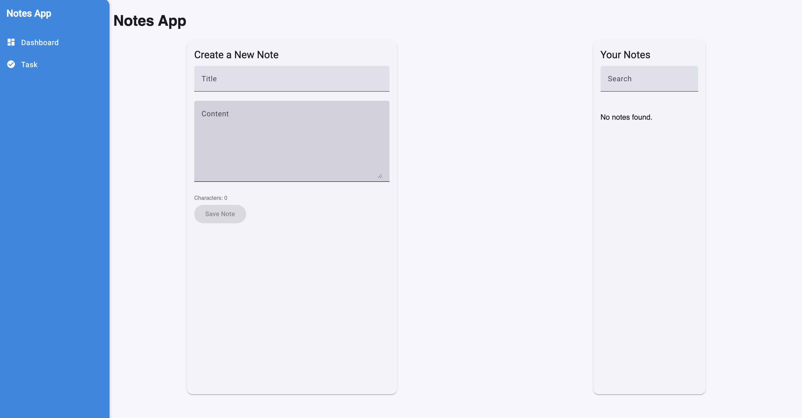

# NotesApp

NotesApp is a simple application built with Angular and TypeScript that allows users to manage their notes. The app is designed with a responsive UI using Angular Material and ensures type safety with TypeScript.

## 🚀 Demo

🔗 [Live Demo - Task Manager App](https://notesapp-rt.netlify.app)

<!-- 🔗 [Live Demo - Notes App](https://tmapp-rt.netlify.app) -->



## Problem Statement

**Task 2: Angular (with TypeScript)**  
**Task:** Build a simple Notes App

### Requirements:

- Users should be able to **create**, **update**, and **delete** notes.
- Use **TypeScript** for state management.
- Implement a **responsive UI** using **Angular Material**.
- Ensure **TypeScript type safety**.

### Bonus Points:

- Implement **search functionality** for notes.
- Add a **character count indicator** for each note.

## Features

- Create, edit, and delete notes.
- Search notes by title or content.
- Display a character count for each note.
- Responsive design for mobile and desktop devices.

## Project Structure

```plaintext
src/
├── app/
│   ├── core/          # Core components like header and layout
│   ├── pages/         # Pages like dashboard and task
│   ├── shared/        # Shared models and services
│   ├── app.component.ts
│   ├── app.routes.ts
│   └── app.config.ts
├── index.html
├── main.ts
├── styles.scss
```

## Getting Started

### Prerequisites

Ensure you have the following installed:

- [Node.js](https://nodejs.org/) (v16 or higher)
- [Angular CLI](https://angular.dev/cli) (v19.2.9)

### Installation

1. Clone the repository:

   ```bash
   git clone https://github.com/RicardoTrejoSanjuan/notes-app
   cd notes-app
   ```

2. Install dependencies:
   ```bash
   npm install
   ```

### Running the Development Server

Start the development server:

```bash
ng serve or npm start
```

Open your browser and navigate to `http://localhost:4200/`. The app will reload automatically when you make changes to the source files.

## License

This project is licensed under the MIT License.
